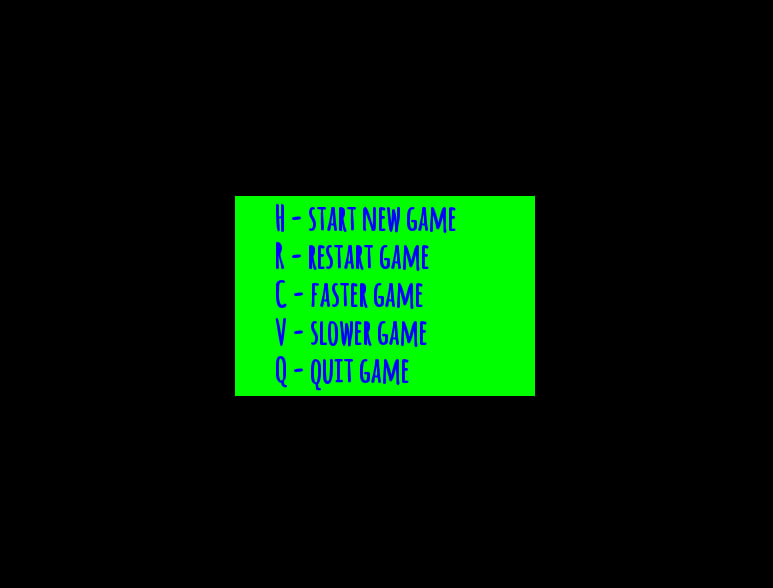
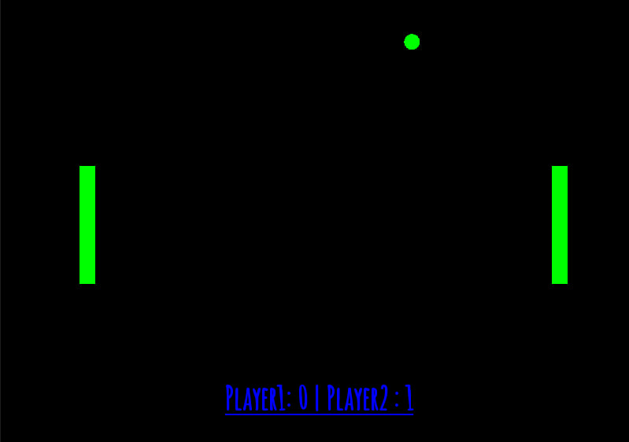

# Pong on SFML
This is simple Pong-game for two players.
## Table of contents
* [General info](#general-info)
* [Technologies](#technologies)
* [Setup](#setup)

## General info
I used SFML for graphics, sound, text and user-computer processing. I created templates of rectangles (players) and a ball, in addition I added a sound when the ball is kicked. At the same time used Audacity to correct the sound. 



The mechanism of bouncing from walls or from players is very simple, as soon as there is a coincidence of extreme coordinates of objects - the ball changes its speed to diametrically opposite with the preservation of all laws of physics.



The game has an initial window where you can select an action, namely start play, restart, speed up, slow down or exit. The player score is highlighted at the bottom, and resets to zero on restart. As for the text, the template was taken the most usual, the main thing is that it was readable.
	
## Technologies
Project is created with:
* SFML-2.6.0 for for visuals and game logic
* Audacity to adjust and change the sound
* The Bible for courage
	
## Setup
To run this project, install it locally using npm:
```
sudo apt-get update
sudo apt-get install libsfml-dev
```
